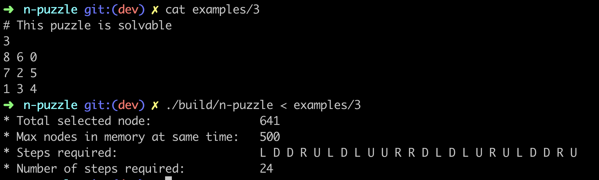
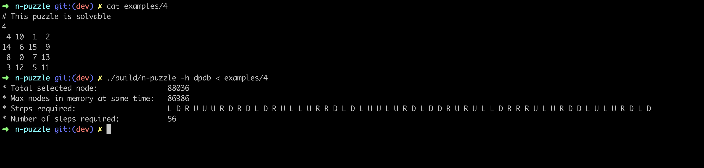

 <div align="center">  
 
 
</div>

# N-puzzle

42 school project requires solving n-puzzle game with A* and similar algorithms, click this [link](https://cdn.intra.42.fr/pdf/pdf/17244/en.subject.pdf) for more info.

## Demo
the project includes a web interface to experiment and play with, you can visit it [here](https://n-puzzle-project.netlify.app/).


## Features
* solving 3\*3 and 4\*4 boards with optimal speed.
* using different algorithms
    * A*
    * IDA*
* using multiple heuristic functions
    * manhattan distance
    * linear conflict
    * disjoint pattern database
* web api to visualize and experiment with the program.

> theoretically the program can solve any bord size (n-puzzle), but in practice it will be to slow for board bigger or equal to 5*5.

## reuirements
> cmake, g++ or clang++

all those programs must be added to your path

## instalation
```bash
git clone https://github.com/ZackChOfficial/n-puzzle.git
cd n-puzzle
./utils/configure.sh && ./utils/build.sh
```

### running web interface localy
#### requirements :
> node, npm, emscripten

```bash
cd web/public/wasm/
./configure.sh && ./build.sh 
cd ../..
npm install
npm start
```

or you can visit it online at this [link](https://n-puzzle-project.netlify.app/).

## Usage

the program reads the board from the standard input and prints a bunch of useful data.
example :


---




Type :
```bash
./buils/n-puzzle -h # form more info about usage
```

## contributors
* [Zakaria Chatouane](https://github.com/ZackChOfficial)
* [Ayoub Aguert](https://github.com/ayoubyt/)

## License
[MIT](https://choosealicense.com/licenses/mit/)